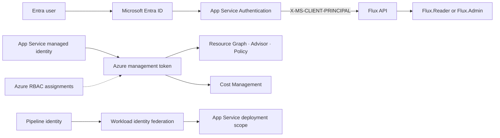

Flux separates user authorization from Azure service authorization into two completely independent identity paths. Users authenticate with Microsoft Entra ID — App Service Authentication validates the token and injects the claims principal before the request reaches Flux. Flux authenticates to Azure with its managed identity — no client secret exists in either path. The two identities never borrow each other's permissions, and a third workload-identity federation credential scoped only to App Service deployment completes the boundary.

## Identity flows

| Flow | Identity | Mechanism |
|---|---|---|
| User → Flux | Microsoft Entra user or group | App Service Authentication and `X-MS-CLIENT-PRINCIPAL` |
| Flux → Azure Resource Graph and Advisor | App Service managed identity | `ManagedIdentityCredential` and Azure RBAC |
| Flux → Cost Management | App Service managed identity | `ManagedIdentityCredential` and `Microsoft.CostManagement/*/read` |



---

## Configure Entra app roles

<Steps>
  <Step title="Define app roles on the Entra app registration">
    On the app registration used by App Service Authentication, open **App roles** and create two roles:

    | Display name | Value | Allowed member types | Description |
    |---|---|---|---|
    | Flux Reader | `Flux.Reader` | Users/Groups | Read-only access to dashboards, inventory, and opportunities |
    | Flux Administrator | `Flux.Admin` | Users/Groups | Read access plus integration configuration and synchronization |

    Both roles must have **Allowed member types** set to `Users/Groups` and must be enabled.
  </Step>

  <Step title="Assign users or groups through the enterprise application">
    In **Azure Active Directory → Enterprise applications**, open the Flux application and navigate to **Users and groups**. Add assignments for each user or group that should have `Flux.Reader` or `Flux.Admin` access.

    Users without an assigned role will receive a `403` with a role message from Flux even if they successfully authenticate with Entra.
  </Step>

  <Step title="Set role mapping application settings">
    By default, Flux maps the role values directly. You can extend or replace them with comma-separated app-role values or group object IDs:

    ```text
    FLUX_ENTRA_ADMIN_ASSIGNMENTS=Flux.Admin,<admin-group-object-id>
    FLUX_ENTRA_READER_ASSIGNMENTS=Flux.Reader,<reader-group-object-id>
    ```

    Group object IDs are useful when authorization is managed centrally through Entra group membership rather than direct app-role assignment.
  </Step>
</Steps>

---

## Enable App Service Authentication

<Steps>
  <Step title="Add the Microsoft identity provider">
    In the App Service → **Authentication** blade, select **Add identity provider** and choose **Microsoft**.

    Use the existing Flux app registration. App Service Authentication will inject a validated `X-MS-CLIENT-PRINCIPAL` header on every authenticated request and remove any client-supplied copy of that header.
  </Step>

  <Step title="Require authentication and set redirect behavior">
    Set **Unauthenticated requests** to **HTTP 302 Found redirect — recommended for websites**. This redirects browser sessions to the Microsoft sign-in page. API clients that cannot follow redirects will receive a `401`.

    Do not set this to **Allow unauthenticated requests** — doing so would allow Flux routes to be reached without a validated principal.
  </Step>

  <Step title="Restrict the issuer to the expected tenant">
    In **Advanced settings**, set the token issuer URL to:

    ```text
    https://login.microsoftonline.com/<tenant-id>/v2.0
    ```

    This rejects tokens issued by any other Entra tenant, preventing cross-tenant token acceptance.
  </Step>

  <Step title="Set the required application settings">
    In **Configuration → Application settings**, add:

    ```text
    FLUX_AUTH_MODE=entra
    FLUX_ENTRA_TENANT_ID=<tenant-guid>
    FLUX_ENTRA_ADMIN_ASSIGNMENTS=Flux.Admin
    FLUX_ENTRA_READER_ASSIGNMENTS=Flux.Reader
    FLUX_AUTH_LOGIN_PATH=/.auth/login/aad
    FLUX_AUTH_LOGOUT_PATH=/.auth/logout
    ```

    These settings are required for Flux to decode the Entra principal, validate the tenant, and map roles. With `FLUX_AUTH_MODE=mock` (the local development default), Flux ignores the principal header entirely and presents a mock administrator session.
  </Step>
</Steps>

---

## Enable managed identity

<Steps>
  <Step title="System-assigned identity">
    System-assigned identity is tied to the App Service lifecycle and requires no additional client ID configuration in Flux.

    ```powershell
    $identity = az webapp identity assign `
      --resource-group <app-resource-group> `
      --name <web-app-name> | ConvertFrom-Json

    $principalId = $identity.principalId
    Write-Host "Managed identity principal ID: $principalId"
    ```

    No `FLUX_MANAGED_IDENTITY_CLIENT_ID` setting is required.
  </Step>

  <Step title="User-assigned identity (optional)">
    If you prefer a user-assigned managed identity — for example, to share credentials across multiple resources or to pre-assign RBAC before the App Service is created — assign the identity and then set its client ID:

    ```powershell
    az webapp identity assign `
      --resource-group <app-resource-group> `
      --name <web-app-name> `
      --identities <user-assigned-identity-resource-id>
    ```

    Then in Application settings:

    ```text
    FLUX_MANAGED_IDENTITY_CLIENT_ID=<managed-identity-client-id>
    ```

    This explicitly selects the user-assigned identity when multiple identities are available on the App Service.
  </Step>
</Steps>

---

## Assign Azure RBAC

<Steps>
  <Step title="Grant Reader for Azure Resource Graph">
    Azure Resource Graph returns only resources the calling principal can read. Grant the managed identity `Reader` on each configured subscription:

    ```powershell
    az role assignment create `
      --assignee-object-id $principalId `
      --assignee-principal-type ServicePrincipal `
      --role Reader `
      --scope /subscriptions/<subscription-guid>
    ```

    Repeat for every subscription Flux will query, or assign at a shared management-group scope. The built-in `Reader` role is sufficient for inventory, Advisor recommendations, and Azure Policy posture through ARG.
  </Step>

  <Step title="Grant Cost Management read access">
    Cost synchronization requires `Microsoft.CostManagement/*/read` at each configured subscription or an inherited management-group scope. The deployed custom **FinOps Platform Reader** role includes this permission:

    ```powershell
    az role assignment create `
      --assignee-object-id $principalId `
      --assignee-principal-type ServicePrincipal `
      --role "FinOps Platform Reader" `
      --scope /subscriptions/<subscription-guid>
    ```

    This is a read-only data-plane path. Flux does not create budgets, exports, reservations, or Azure resources.

    <Note>
      If the `FinOps Platform Reader` custom role is not deployed in your environment, assign a custom role that includes `Microsoft.CostManagement/*/read` and the appropriate resource read permissions. Keep this strictly read-only.
    </Note>
  </Step>

  <Step title="Wait for RBAC propagation">
    Azure RBAC assignments can take several minutes to propagate. If Flux reports managed identity token failure or ARG `403` errors immediately after assignment, wait a few minutes and retry synchronization.

    | Symptom | Likely cause |
    |---|---|
    | Managed identity token failure | Identity is not enabled, or the user-assigned client ID is wrong |
    | ARG `403` | Managed identity lacks `Reader` or custom read access at the requested scope |
    | Empty ARG result | Identity can authenticate but cannot read resources in the configured subscriptions |
    | Cost `403` | Managed identity lacks `Microsoft.CostManagement/*/read` at the subscription or an inherited scope |
    | Cost `429` | Cost Management throttled the query; Flux retries, preserves completed scopes, and retains previous successful scope data |
  </Step>
</Steps>

---

## How Flux decodes the principal

App Service validates the user token and injects a Base64-encoded claims document in the `X-MS-CLIENT-PRINCIPAL` request header. Flux processes this on every authenticated request:

1. **Decode** the Base64 document into the claims array.
2. **Validate the tenant claim** — when `FLUX_ENTRA_TENANT_ID` is configured, Flux rejects principals whose tenant does not match.
3. **Map role and group claims** — role values and group object IDs in `FLUX_ENTRA_ADMIN_ASSIGNMENTS` and `FLUX_ENTRA_READER_ASSIGNMENTS` are matched against the principal's claims.
4. **Return the resolved session** from `/api/session` — the response carries the resolved role (`reader` or `admin`), the user's display name, and whether admin features are available.
5. **Enforce reader/admin boundaries** on API routes. The frontend hides Integrations from readers, but the API authorization checks are the security boundary.

<Warning>
  The application trusts `X-MS-CLIENT-PRINCIPAL` only because App Service removes any external copy of this header and injects its own validated value. Do not expose a Flux process configured with `FLUX_AUTH_MODE=entra` through any route that bypasses App Service Authentication. A bypassed route allows unauthenticated or spoofed access.
</Warning>

---

## Local development

For local development, Flux defaults to mock authentication:

```text
FLUX_AUTH_MODE=mock
```

This presents a mock administrator session without any Entra token, making local development possible without an App Service or app registration.

To test Azure data access locally, authenticate with Azure PowerShell and use the local provider:

```powershell
Connect-AzAccount
```

Then select **Local Azure PowerShell context** in Integrations.

For controlled authorization testing, you may set `FLUX_AUTH_MODE=entra` locally and send a locally generated `X-MS-CLIENT-PRINCIPAL` header. Never apply this pattern to a production route — only use `entra` mode behind correctly configured App Service Authentication.

<Tip>
  If you receive `401` from Flux with `entra` mode enabled, App Service did not inject a principal. Check that Easy Auth is configured correctly and that the request is reaching Flux through the App Service authentication layer, not a bypass route. A `403` with a role message means the user is authenticated but has no mapped Flux role — check their group or app-role assignment.
</Tip>
